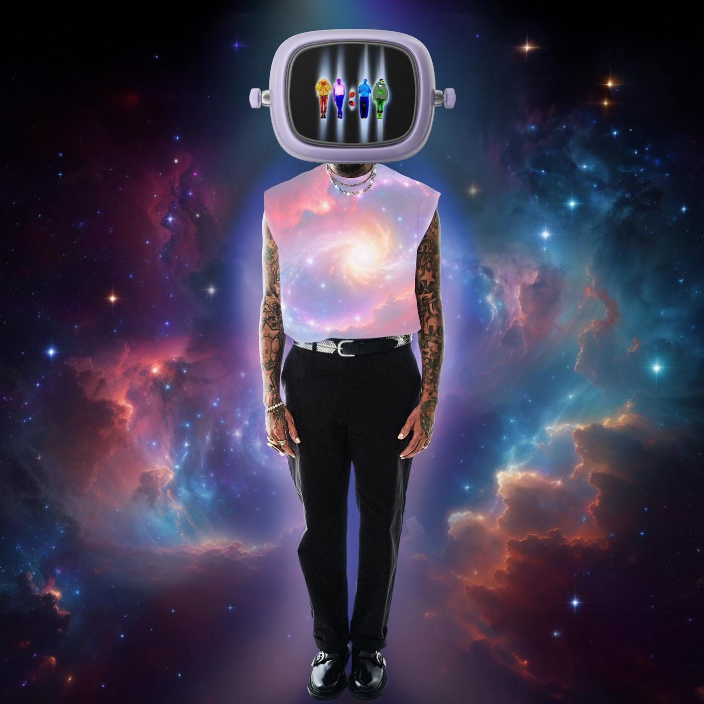
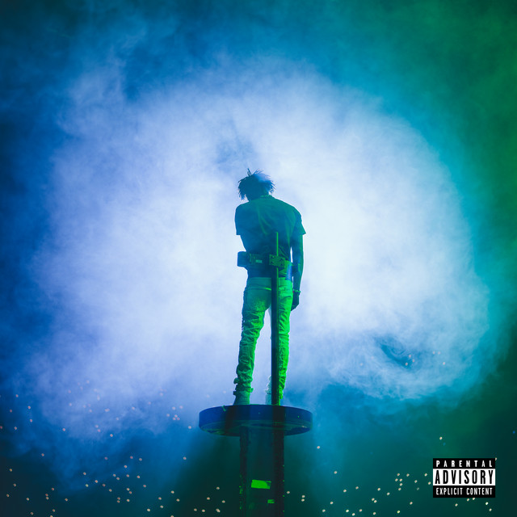

# 🎨 Album Cover Blur (Java)


---

## 📸 Vorher / Nachher

### Beispiel 1: Deep Blue
| Album-Cover (Input) | Generierter Hintergrund (Output) |
| :---: | :---: |
|  |  |

### Beispiel 2: Dark Purple
| Album-Cover (Input) | Generierter Hintergrund (Output) |
| :---: | :---: |
|  |  |

### Beispiel 3: Deep Teal / Green
| Album-Cover (Input) | Generierter Hintergrund (Output) |
| :---: | :---: |
|  |  |
---

## 🚀 Overview

Dieses Tool generiert dynamische, weichgezeichnete UI Hintergründe direkt aus Album Covern. Der Code die dominanten Farben per **K-Means Algorithmus** und nutzt einen schnellen Grafik Trick für den perfekten Glow Effekt.

Das Ganze läuft komplett auf Core Java (AWT), ohne dass man irgendwelche externen Bibliotheken installieren muss.

---

## 🏗️ Wie es aufgebaut ist

Das Projekt teilt die Arbeit in drei einfache Schritte auf:

* **ImageProcessor (Das Sieb):** Lädt das Bild und filtert unbrauchbare Pixel vorab aus. Zu dunkle Schatten, reines Weiß oder fade Grautöne fliegen raus, damit nur die echten, kräftigen Pigmente analysiert werden.
* **ColorClusteringService (Die Mathe-Logik):** Mein K-Means-Algorithmus gruppiert die verbleibenden Pixel und berechnet die exakten 4 Hauptfarben des Covers.
* **BackgroundGenerationService (Der Grafik-Trick):** Setzt die 4 Farben in die Ecken eines winzigen $8 \times 8$ Pixel Bildes. Beim Hochskalieren auf Full-HD sorgt Javas bilineare Interpolation dafür, dass die Kanten extrem weichgezeichnet werden und der wolkige Verlauf entsteht.

---

## 🧠 Core Logic

### 1. Pixelfilterung (HSB-Modell)
Damit der K-Means nicht von großen weißen oder schwarzen Flächen abgelenkt wird, rechnen wir die RGB-Pixel in das HSB-Modell um und sieben aus:
* **Sättigung:** $\text{Saturation} > 0.15$ (Sortiert Grau/Weiß/Schwarz aus)
* **Helligkeit:** $0.15 < \text{Brightness} < 0.85$ (Ignoriert extreme Schatten und Lichter)

### 2. Bilinear Scaling Blur
Für den flüssigen Verlauf nutzen wir keinen schweren Weichzeichner, sondern jagen das $8 \times 8$ Mini-Bild mit `RenderingHints.VALUE_INTERPOLATION_BILINEAR` auf Full-HD ($1920 \times 1080$). Java berechnet die Übergänge zwischen den Eckpunkten automatisch flüssig:

$$\text{Interpolation}(x, y) = (1-t)(1-u)P_{1} + t(1-u)P_{2} + (1-t)uP_{3} + tuP_{4}$$

---

## 💻 Code-Beispiel

So wird die Pipeline in der `Main.java` gestartet:

```java
// 1. Pixel laden und filtern
ImageProcessor processor = new ImageProcessor();
List<Pixel> filteredPixels = processor.extractPixels("./album_cover.jpg");

// 2. Die 4 Hauptfarben berechnen
ColorClusteringService clusteringService = new ColorClusteringService();
ColorPalette palette = clusteringService.calculatePalette(filteredPixels, 4);

// 3. Den Hintergrund in Full-HD generieren
BackgroundGenerationService backgroundService = new BackgroundGenerationService();
BufferedImage background = backgroundService.generateBackground(palette, 1920, 1080);

// 4. Als PNG speichern
ImageIO.write(background, "png", new File("./apple_glow_background.png"));
